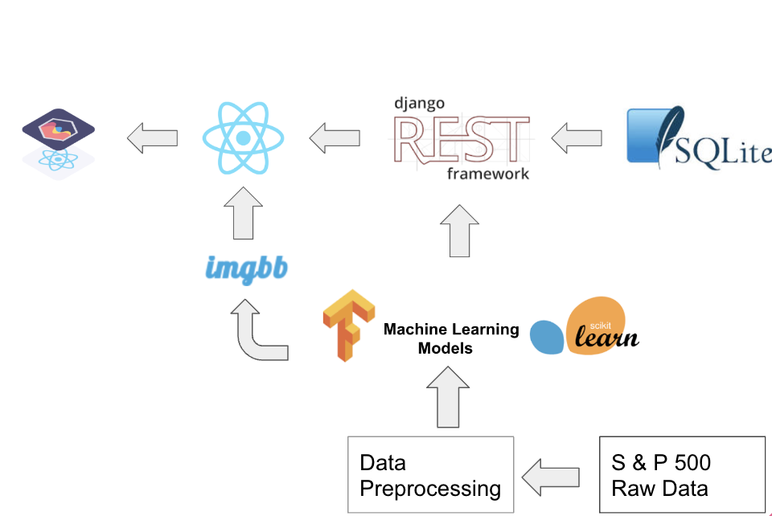

# EECS6895_finalproject

# Investment Strategy: Django Backend and React Frontend

This project implements an investment strategy system that utilizes machine learning techniques for effective portfolio management. The system consists of a Django backend and a React frontend, providing a seamless integration between the server-side and client-side components.

## Features

- Allows users to manage investment portfolios and track their performance.
- Utilizes machine learning techniques to identify financial trends and optimize portfolio allocation.
- Provides real-time data updates and analysis for informed decision-making.
- Supports user authentication and authorization for secure access to portfolio management features.

## Technologies Used

- Django: A powerful Python web framework for building the backend server.
- Django REST Framework: Enables the creation of RESTful APIs for communication between the backend and frontend.
- React: A popular JavaScript library for building interactive user interfaces.
- Chart.js: A versatile charting library for visualizing financial trends and performance.

## Installation

1. Clone the repository: `git clone <repository_url>`
2. Set up the Django backend:
   - Create a virtual environment: `python -m venv venv`
   - Activate the virtual environment:
     - On Windows: `venv\Scripts\activate`
     - On macOS/Linux: `source venv/bin/activate`
   - Install the Python dependencies: `pip install -r requirements.txt`
   - Apply database migrations: `python manage.py migrate`
   - Run the backend server: `python manage.py runserver`
3. Set up the React frontend:
   - Navigate to the `frontend` directory: `cd advbigdata_frontend`
   - Install the Node.js dependencies: `npm install`
   - Start the frontend development server: `npm start`
4. Access the application: Open your web browser and visit `http://localhost:3000` to use the investment strategy system.
5. Machine Learning Trained models present in the root directory Adv_Big_Data_Project.ipynb.

## Usage

- Navigate through the application to manage your investment portfolio.
- Utilize the machine learning features to analyze financial trends and optimize portfolio allocation.
- Monitor the performance of your investments through visualizations and real-time data updates.

